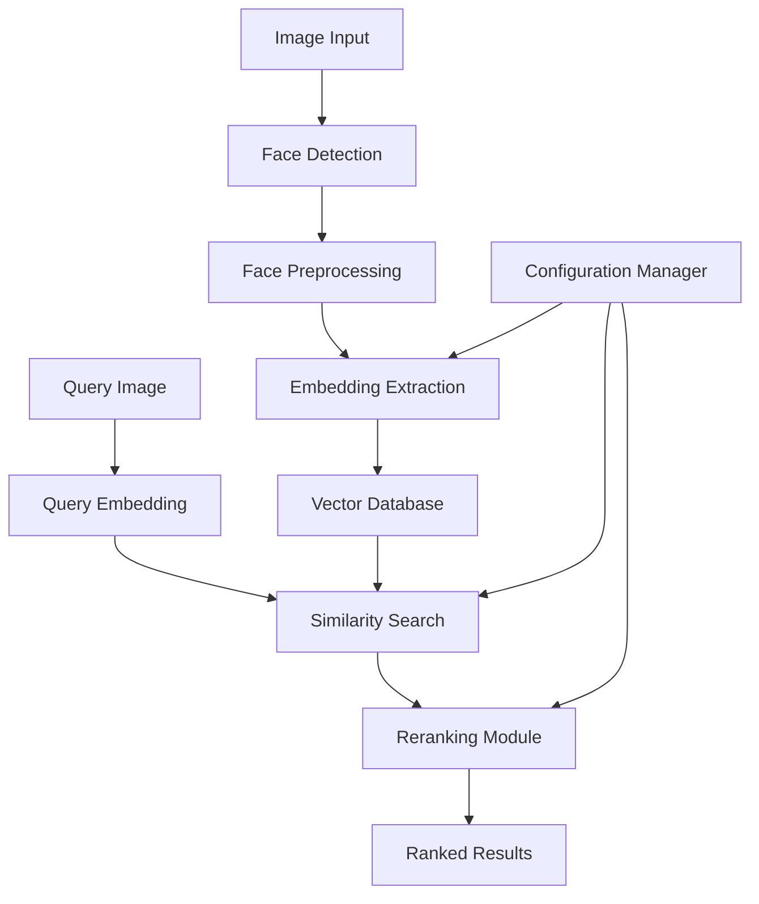

# Face Recognition System Design

## Overview

The face recognition system is built around a pipeline architecture that processes images through face detection, embedding extraction, vector storage, similarity search, and reranking. The system uses modern deep learning models for face embedding generation and efficient vector databases for similarity search operations.

## Architecture



The system follows a modular design with clear separation of concerns:

- **Input Processing Layer**: Handles image input, validation, and preprocessing
- **Face Processing Layer**: Detects faces and extracts embeddings
- **Storage Layer**: Manages vector database operations and indexing
- **Search Layer**: Performs similarity search and reranking
- **Configuration Layer**: Manages system parameters and thresholds

## Components and Interfaces

### 1. Face Detection Module

**Purpose**: Detect and extract face regions from input images

**Key Classes**:
- `FaceDetector`: Main interface for face detection
- `FaceRegion`: Data class representing detected face coordinates and confidence

**Methods**:
```python
class FaceDetector:
    def detect_faces(self, image: np.ndarray) -> List[FaceRegion]
    def preprocess_face(self, image: np.ndarray, face_region: FaceRegion) -> np.ndarray
```

### 2. Embedding Extraction Module

**Purpose**: Convert face images into high-dimensional embedding vectors

**Key Classes**:
- `EmbeddingExtractor`: Main interface for embedding generation
- `FaceEmbedding`: Data class containing embedding vector and metadata

**Methods**:
```python
class EmbeddingExtractor:
    def extract_embedding(self, face_image: np.ndarray) -> FaceEmbedding
    def batch_extract_embeddings(self, face_images: List[np.ndarray]) -> List[FaceEmbedding]
```

### 3. Vector Database Module

**Purpose**: Store, index, and retrieve facial embeddings efficiently

**Key Classes**:
- `VectorDatabase`: Main interface for vector operations
- `SearchResult`: Data class for search results with similarity scores

**Methods**:
```python
class VectorDatabase:
    def store_embedding(self, embedding: FaceEmbedding, metadata: Dict) -> str
    def search_similar(self, query_embedding: FaceEmbedding, top_k: int) -> List[SearchResult]
    def delete_embedding(self, embedding_id: str) -> bool
```

### 4. Similarity Search Module

**Purpose**: Perform efficient similarity search with configurable parameters

**Key Classes**:
- `SimilaritySearcher`: Main search interface
- `SearchConfig`: Configuration for search parameters

**Methods**:
```python
class SimilaritySearcher:
    def search(self, query_embedding: FaceEmbedding, config: SearchConfig) -> List[SearchResult]
    def set_threshold(self, threshold: float) -> None
```

### 5. Reranking Module

**Purpose**: Improve search result quality through advanced ranking algorithms

**Key Classes**:
- `Reranker`: Main reranking interface
- `RerankingFeatures`: Additional features for reranking

**Methods**:
```python
class Reranker:
    def rerank_results(self, results: List[SearchResult], query_features: RerankingFeatures) -> List[SearchResult]
    def extract_reranking_features(self, face_image: np.ndarray) -> RerankingFeatures
```

### 6. Face Recognition Pipeline

**Purpose**: Orchestrate the entire face recognition workflow

**Key Classes**:
- `FaceRecognitionPipeline`: Main system interface
- `RecognitionRequest`: Input request data class
- `RecognitionResponse`: Output response data class

**Methods**:
```python
class FaceRecognitionPipeline:
    def recognize_face(self, request: RecognitionRequest) -> RecognitionResponse
    def add_face_to_database(self, image: np.ndarray, metadata: Dict) -> str
    def batch_process_images(self, images: List[np.ndarray]) -> List[RecognitionResponse]
```

## Data Models

### FaceEmbedding
```python
@dataclass
class FaceEmbedding:
    vector: np.ndarray  # High-dimensional embedding vector
    dimension: int      # Vector dimension (e.g., 512)
    model_version: str  # Version of the embedding model used
    extraction_timestamp: datetime
```

### FaceRegion
```python
@dataclass
class FaceRegion:
    x: int              # Top-left x coordinate
    y: int              # Top-left y coordinate
    width: int          # Face region width
    height: int         # Face region height
    confidence: float   # Detection confidence score
```

### SearchResult
```python
@dataclass
class SearchResult:
    embedding_id: str   # Unique identifier for the matched embedding
    similarity_score: float  # Similarity score (0.0 to 1.0)
    metadata: Dict      # Associated metadata
    rerank_score: Optional[float] = None  # Score after reranking
```

### SearchConfig
```python
@dataclass
class SearchConfig:
    top_k: int = 10                    # Number of results to return
    similarity_threshold: float = 0.7   # Minimum similarity threshold
    enable_reranking: bool = True      # Whether to apply reranking
    distance_metric: str = "cosine"    # Distance metric for similarity
```

## Error Handling

### Exception Hierarchy
```python
class FaceRecognitionError(Exception):
    """Base exception for face recognition system"""
    pass

class FaceDetectionError(FaceRecognitionError):
    """Raised when face detection fails"""
    pass

class EmbeddingExtractionError(FaceRecognitionError):
    """Raised when embedding extraction fails"""
    pass

class VectorDatabaseError(FaceRecognitionError):
    """Raised when vector database operations fail"""
    pass

class InvalidImageError(FaceRecognitionError):
    """Raised when input image is invalid or corrupted"""
    pass
```

### Error Handling Strategy
- **Graceful Degradation**: System continues operation when non-critical components fail
- **Detailed Logging**: All errors are logged with context and stack traces
- **User-Friendly Messages**: Error messages are clear and actionable
- **Retry Logic**: Transient failures are automatically retried with exponential backoff

## Testing Strategy

### Unit Testing
- **Face Detection**: Test with various image types, lighting conditions, and face angles
- **Embedding Extraction**: Verify embedding consistency and dimension correctness
- **Vector Database**: Test CRUD operations, search accuracy, and performance
- **Similarity Search**: Validate distance calculations and threshold handling
- **Reranking**: Test ranking improvements and feature extraction

### Integration Testing
- **End-to-End Pipeline**: Test complete workflow from image input to ranked results
- **Batch Processing**: Verify batch operations handle errors and provide progress updates
- **Configuration Changes**: Test system behavior with different parameter settings

### Performance Testing
- **Search Latency**: Ensure sub-second response times for similarity search
- **Throughput**: Test batch processing performance with large image sets
- **Memory Usage**: Monitor memory consumption during embedding extraction and storage
- **Scalability**: Test system behavior with growing vector database sizes

### Test Data Requirements
- **Diverse Face Dataset**: Images with various ethnicities, ages, lighting conditions
- **Edge Cases**: Blurry images, multiple faces, no faces, corrupted files
- **Performance Benchmarks**: Standardized datasets for accuracy and speed comparisons

## Technology Stack

### Core Libraries
- **Face Detection**: OpenCV, MTCNN, or RetinaFace
- **Embedding Models**: FaceNet, ArcFace, or InsightFace
- **Vector Database**: Faiss, Pinecone, or Weaviate
- **Image Processing**: OpenCV, PIL
- **Machine Learning**: PyTorch or TensorFlow

### Infrastructure
- **API Framework**: FastAPI for REST endpoints
- **Configuration**: Pydantic for configuration management
- **Logging**: Structured logging with JSON format
- **Monitoring**: Metrics collection for performance tracking